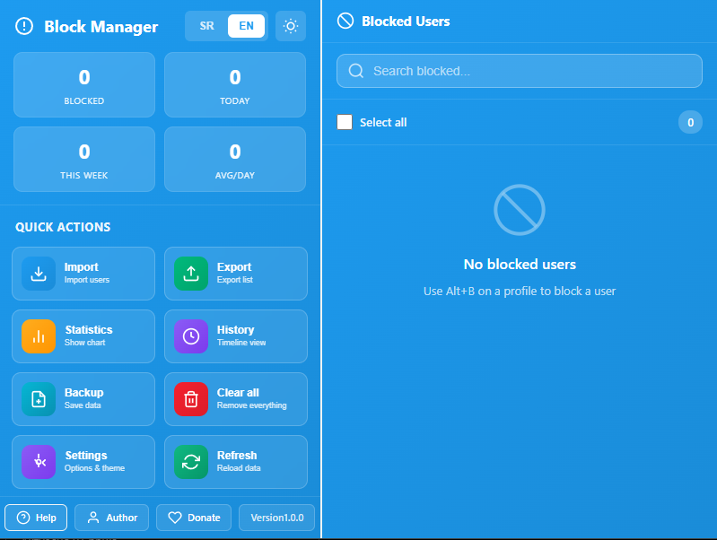
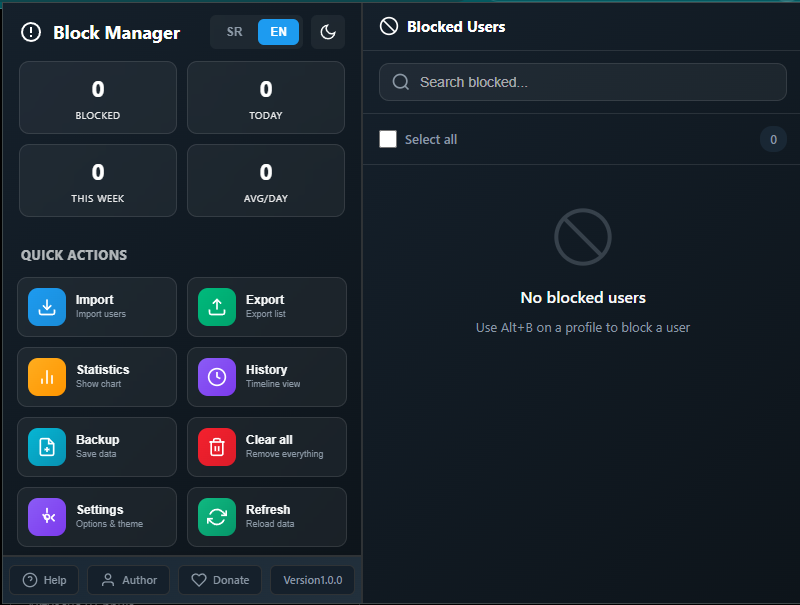

# 🚫 Block Manager for Twitter/X and 1click block

> **The ultimate tool for managing your Twitter/X experience. Block users instantly, manage lists, and visualize your blocking habits with a beautiful, modern interface.**

[🇷🇸 Srpski](#-srpski) | [🇬🇧 English](#-english)

---

## 🇬🇧 English

### ✨ Features

#### 🎨 Modern & Beautiful UI
- **Glassmorphism Design** - Stunning semi-transparent interface with blur effects
- **Blue Theme** - Perfectly matches Twitter's branding in Light Mode
- **Midnight Dark Mode** - Deep, elegant dark theme for night usage
- **Toast Notifications** - Non-intrusive, elegant status updates

#### 🎯 Core Functionality
- **⌨️ Alt+B Shortcut** - Instantly block users from their profile page
- **📋 Advanced Manager** - Search, filter, and manage blocked users
- **📊 Visual Statistics** - Beautiful charts and activity tracking
- **🏷️ Smart Tagging** - Organize blocked users with custom tags
- **📝 Notes & Reasons** - Keep track of why you blocked someone

#### 🛡️ Data Management
- **📥 Import/Export** - Easily transfer your block list
- **💾 Backup System** - Never lose your data
- **🗑️ Bulk Actions** - Delete or unblock multiple users at once
- **🔄 Auto-Sync** - Changes reflect immediately across all tabs

### 🚀 Installation

1. Download the latest release or clone the repo
2. Open Chrome and go to `chrome://extensions/`
3. Enable **"Developer mode"** (top right)
4. Click **"Load unpacked"**
5. Select the `chrometwiter` folder

### 📖 Quick Start

1. **Block a User:** Go to any profile and press `Alt+B`
2. **Open Manager:** Click the extension icon to see your list
3. **Manage:** Use the dashboard to search, tag, or export your data

---

## 🇷🇸 Srpski

### ✨ Mogućnosti

#### 🎨 Moderan Dizajn
- **Glassmorphism** - Prelep polu-providan interfejs sa blur efektima
- **Plava Tema** - Savršeno se uklapa uz Twitter brending (Svetla tema)
- **Midnight Dark Mode** - Elegantna tamna tema za noćno korišćenje
- **Toast Notifikacije** - Suptilna i moderna obaveštenja

#### 🎯 Glavne Funkcije
- **⌨️ Alt+B Prečica** - Trenutno blokiranje sa profila korisnika
- **📋 Napredni Menadžer** - Pretraga, filtriranje i upravljanje listom
- **📊 Vizuelna Statistika** - Grafikoni i praćenje aktivnosti
- **🏷️ Pametno Tagovanje** - Organizujte korisnike pomoću tagova
- **📝 Beleške** - Zapišite razlog blokiranja

#### 🛡️ Upravljanje Podacima
- **📥 Import/Export** - Lako prebacite vašu listu
- **💾 Backup Sistem** - Sačuvajte vaše podatke
- **🗑️ Masovne Akcije** - Obrišite ili odblokirajte više korisnika odjednom
- **🔄 Auto-Sinhronizacija** - Promene se vide odmah u svim tabovima

### 🚀 Instalacija

1. Preuzmite poslednju verziju ili klonirajte repozitorijum
2. Otvorite Chrome i idite na `chrome://extensions/`
3. Uključite **"Developer mode"** (gore desno)
4. Kliknite **"Load unpacked"**
5. Izaberite `chrometwiter` folder

### 📖 Brzi Start

1. **Blokiraj:** Idi na bilo koji profil i pritisni `Alt+B`
2. **Otvori Menadžer:** Klikni na ikonicu ekstenzije
3. **Upravljaj:** Koristi dashboard za pretragu, tagovanje ili export

---

### 🛠️ Tech Stack

- **Manifest V3**
- **Vanilla JavaScript (ES6 Modules)**
- **CSS3 Variables & Glassmorphism**
- **Chrome Storage & Runtime API**

### 🔒 Privacy

- **No Tracking:** We don't collect any data.
- **Local Storage:** All data stays on your device.
- **Open Source:** Code is transparent and auditable.

### 👨‍💻 Author

**Portfolio:** [https://mojportfolio.vercel.app](https://mojportfolio.vercel.app)
**Support:** [PayPal](https://www.paypal.com/paypalme/o0o0o0o0o0o0o)

**License:** MIT

---

**Version:** 1.0.0
**Manifest Version:** 3

---

## 🌟 Screenshots

  
  

---

**Made for a better Twitter/X experience**
